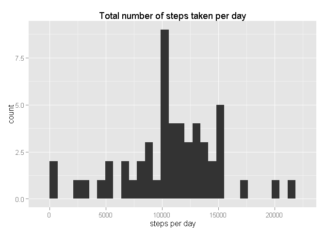
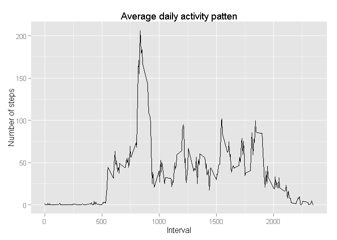
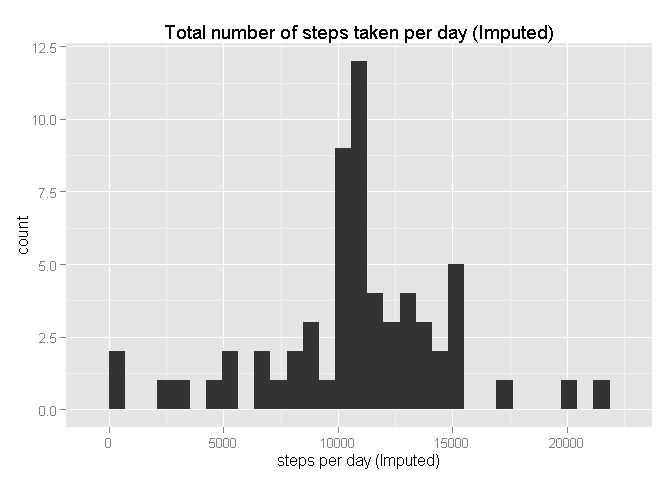
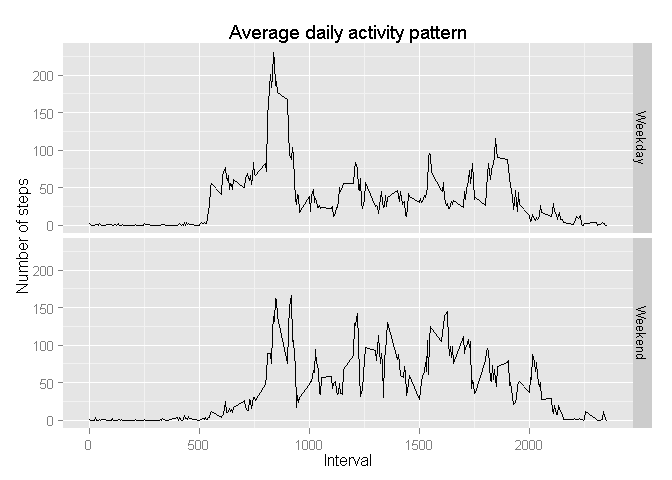

# Reproducible Research: Peer Assessment 1

##knitr options

```r
library(knitr)
opts_chunk$set(message=F)
```


## Loading and preprocessing the data

```r
require(plyr)
require(ggplot2)

unzip(zipfile = "activity.zip")
data <- read.csv("activity.csv")
data <- transform(data, date = as.Date(date))
```


## What is mean total number of steps taken per day?
Get total number of steps per day

```r
stepsPerDay <- ddply(data, ~date, summarise, steps = sum(steps))
```

Plot histogram

```r
p <- ggplot(stepsPerDay, aes(steps))
p <- p + geom_histogram()
p <- p + ggtitle("Total number of steps taken per day")
p <- p + xlab("steps per day")
p
```

 

Get mean and median

```r
stepsPerDayMean <- mean(stepsPerDay$steps, na.rm=T)
stepsPerDayMedian <- median(stepsPerDay$steps, na.rm=T)
```

- Mean of total number of steps taken per day: 10766.19
- Median of total number of steps taken per day: 10765


## What is the average daily activity pattern?
Get average steps per 5 minute interval

```r
stepsPerIntervalAvg <- ddply(data, ~interval, summarise, mean = mean(steps, na.rm = T))
```

Time series plot

```r
p <- ggplot(stepsPerIntervalAvg, aes(interval, mean))
p <- p + geom_line()
p <- p + ggtitle("Average daily activity patten")
p <- p + xlab("Interval")
p <- p + ylab("Number of steps")
p
```

 

Get interval with average max steps

```r
maxStepsAvg <- which.max(stepsPerIntervalAvg$mean)
maxStepsAvgInterval <- stepsPerIntervalAvg$interval[maxStepsAvg]
```

- 5 minute interval with max steps on average: 835

## Imputing missing values
Get total missing values

```r
missingValues <- sum(apply(is.na(data), 1, any))
```

-- Total missing values: 2304

Calculate mean of 5 minute interval across all days and replace NAs

```r
fImpute <- function(data) {
    ddply(data, ~interval, function(subdata) {
        steps <- subdata$steps
        subdata$steps[is.na(steps)] <- mean(steps, na.rm=T)
        return(subdata)
    })
}
```

Create dataset with imputed values

```r
dataImputed <- fImpute(data)
```

Get total number of steps per day (Imputed)

```r
stepsPerDayImputed <- ddply(dataImputed, ~date, summarise, steps = sum(steps))
```

Plot histogram (Imputed)

```r
p <- ggplot(stepsPerDayImputed, aes(steps))
p <- p + geom_histogram()
p <- p + ggtitle("Total number of steps taken per day (Imputed)")
p <- p + xlab("steps per day (Imputed)")
p
```

 

Get mean and median (Imputed)

```r
stepsPerDayMeanImputed <- mean(stepsPerDayImputed$steps, na.rm=T)
stepsPerDayMedianImputed <- median(stepsPerDayImputed$steps, na.rm=T)
```

- Mean of total number of steps taken per day (Imputed): 10766.19
- Median of total number of steps taken per day (Imputed): 10766.19

Mean is unaffected by imputing values since the imputed values are equal to the Mean.
Median increases because we have introduced more values that are equal to the Mean.

## Are there differences in activity patterns between weekdays and weekends?
Categorize weekdays and weekends with factor variable

```r
weekParts <- c("Weekday", "Weekend")
fWeekPart <- function(date) {
    dayOfWeek <- weekdays(date)
    weekPart <- factor("Weekday", weekParts)
    if (dayOfWeek %in% c("Saturday", "Sunday"))
        weekPart <- factor("Weekend", weekParts)
    return(weekPart)
}

dataImputed$weekPart <- sapply(dataImputed$date, fWeekPart)
```

Get average steps per interval and week part

```r
avgStepsPerWeekPart <- ddply(dataImputed, .(interval, weekPart), summarise, mean = mean(steps))
```

Panel plot time series grouped by week part

```r
p <- ggplot(avgStepsPerWeekPart, aes(interval, mean))
p <- p + geom_line()
p <- p + facet_grid(weekPart ~ .)
p <- p + ggtitle("Average daily activity pattern")
p <- p + xlab("Interval")
p <- p + ylab("Number of steps")
p
```

 
